# 📰 뉴스타 (Newstar)


<br /><br />

# 목차

1. [개요](#개요)
2. [프로젝트 소개](#프로젝트-소개)
3. [서비스 화면](#서비스-화면)
4. [기술 소개](#주요-기술)
5. [서비스 개선](#서비스-개선)
6. [협업 환경](#협업-환경)
7. [팀원 소개](#팀원-소개)

<br /><br />

# 개요

**SSAFY 10기 2학기 특화 프로젝트**

저희 **뉴스타**는 인스타와 뉴스의 합성어로 `'간결하고 효율적인 뉴스 소비를 돕는 서비스'`를 제공하고자 만들어졌습니다. <br /><br />
최근 유튜브 쇼츠나 인스타그램 릴스와 같은 짧은 형식의 콘텐츠가 유행하면서, 사람들은 긴 글이나 영상보다는 `짧고 간결한 정보`를 선호하는 경향이 뚜렷해졌습니다. <br /><br />
그리고 많은 사람들이 뉴스를 매일 접하고 싶어 하지만, 수많은 뉴스 소스와 복잡한 정보 사이에서 어떤 것이 중요한지, 어떻게 접근해야 할지 판단하기 어려워합니다. <br /><br />
이러한 배경을 바탕으로, 저희는 사용자가 `자신의 관심 분야`에 맞는 뉴스를 손쉽게, 그리고 `빠르게` 접할 수 있습니다. 또한 바쁜 일상 속에서도 중요한 정보를 놓치지 않고, 뉴스와 친해질 수 있는 기회를 제공하고자 이 서비스를 기획하게 되었습니다.

개발기간 : 2024.02.19 ~ 2024.04.05 (7주)

<br /><br />

# 프로젝트 소개

### 📋 서비스명

- 뉴스타 (Newstar)

### 🎯 페르소나

- SNS와 짧은 영상 콘텐츠에 익숙하며, 정보의 홍수 속에서 중요한 뉴스를 빠르게 파악하고 싶어하는 바쁜 일상속의 현대인

### 🎵 주요 서비스

- 숏폼 뉴스 : 사용자 선호도에 따라 맞춤 뉴스 기사를 숏폼 형식으로 제공
- QR code : 로그인 대신 QR 코드로 제공되는 Key값을 통해 사용자의 관심분야를 저장, 편리한 맞춤형 정보 소비 제공

### 🗺️ 배포 주소

⭐ https://newstar.world/ ⭐ <br />

### 🛠️ 기술 스택

- ⚙ Management Tool

  
  
  
  
  

- 🖥 IDE

  
  

- 📨 Infra

  
  
  
  
  
  

- 📱 Frontend

  
  
  
  
    
  
  
  

- 💾 Backend

  
  
  
  
  

### 📑 기능 명세서

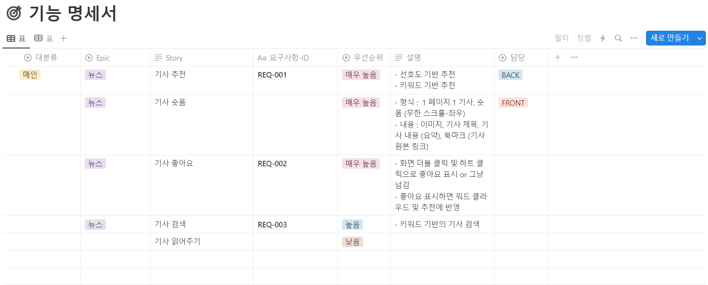
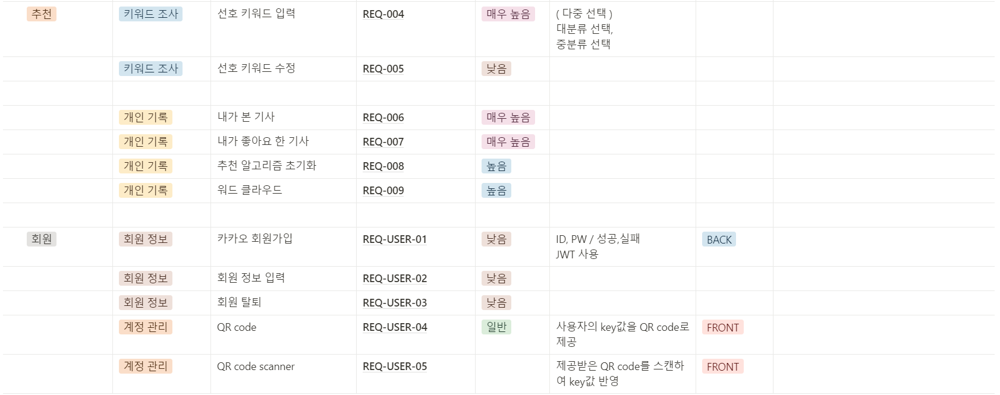

### 📝 ERD

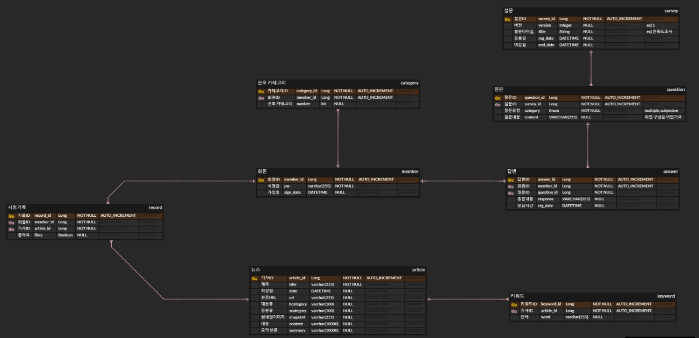

### 📝 아키텍처

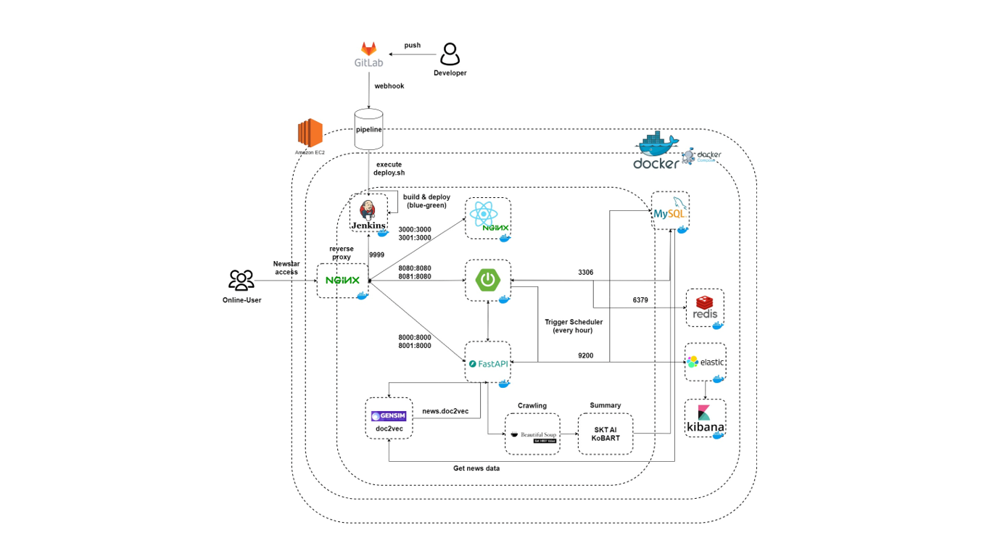

<br /><br />

# 서비스 화면

1. Intro : 서비스의 기획의도를 포함하는 화면

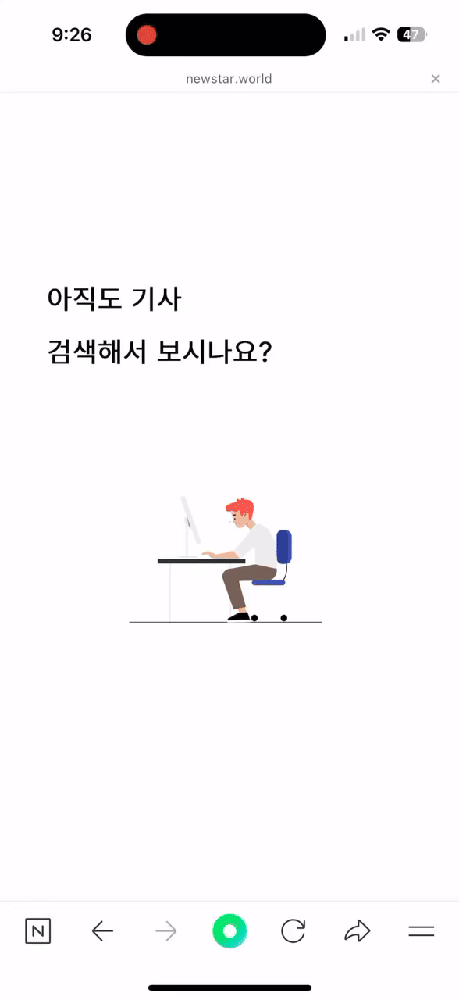

2. 카테고리 선택 & QR code 저장 & Tour : 사용자의 선호도를 선택하고 QR code를 통해 사용자의 정보를 저장, 서비스의 사용방법을 보여주는 화면


3. Main : 사용자가 선택한 카테고리를 반영하여 뉴스를 요약하여 ShortForm 형식의 뉴스를 제공


4. Search : 원하는 키워드를 입력하고 검색하면 키워드 맞춤 뉴스 제공


5. Category : 뉴스 카테고리 맞춤 숏폼 뉴스 제공

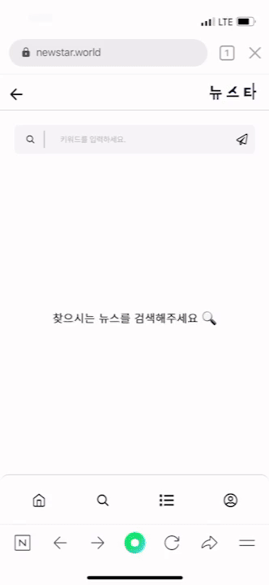

6. MyPage : 내가 시청한 뉴스기록과 내가 좋아요한 뉴스기록을 다시 확인할 수 있는 화면

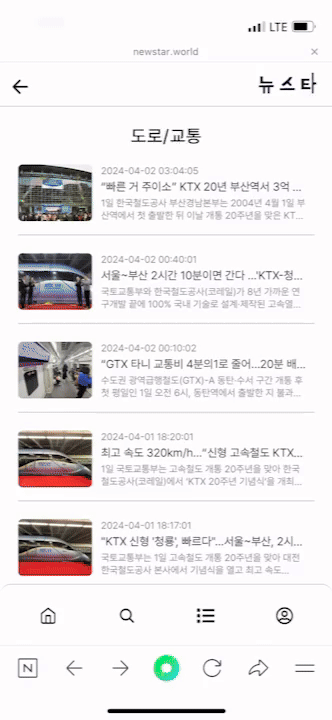

<br /><br />

# 기술 소개

### - Elasticsearch <br />

데이터 검색 및 분석을 위한 오픈 소스 분산 검색 및 분석 엔진으로 저희 서비스의 데이터를 신속하고 효율적으로 분석하기위해 도입하였습니다.

- 도입 이유

1. 검색 속도 향상 : 사용자가 웹 서비스에서 데이터를 신속하게 검색하고 검색 결과를 조회할 수 있도록 하였습니다.
2. 확장성 및 성능 : 분산 아키텍처를 통해 데이터를 효울적으로 분사하여 처리하고, 클러스터의 확장성을 확보하여 서비스의 성능을 향상시켰습니다.
3. 실시간 분석 기능 : 실시간 색인 기능을 활용하여 사용자 행동 및 데이터 흐름을 실시간으로 분석하고 시각화하는 기능을 제공할 수 있습니다.

### - Algorithm

### - Crawling <br />

메인 서버인 스프링 서버에서 매시 5분에 trriger를 발생시켜 네이버 뉴스 기사를 크롤링하였습니다.

1. 기사들의 시간 데이터가 12시간 기준과 24시간 기준으로 각각 다르게 되어있어서 해당 데이터를 정제해서 크롤링하였습니다.
2. 시간마다 자동으로 돌아가는 크롤링을 구현하기 위해서 큰 카테고리 중 작은 카테고리에 들어가서 리스트를 추출하였습니다.
3. IP차단을 방지하기 위해서 중간의 시간을 딜레이 시켰습니다.
4. 데이터 중복을 방지하고자 크롤링하는 현시간의 직전 한시간들의 기사들만 가져와서 데이터의 정합성을 향상시켰습니다.

<br /><br />

# 서비스 개선

서비스를 이용하면서 깜짝으로 등장하는 `설문조사`를 만들어 사용자의 사용 후기와 개선 사항 피드백을 취합하였다.

<details>
  <summary>1차 배포 결과</summary>
  
  - `사용자 수` : 2024년 3월 29일(금) ~ 2024년 4월 1일(월) - 166명
    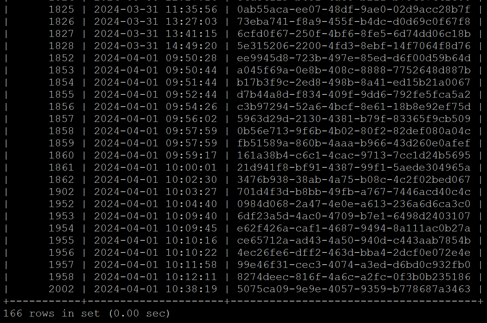

- `사용자 시청 기록`

  - 총 5063개의 뉴스 시청
  - 인당 약 30개 시청
    

- `설문 결과` : 총 24명 참가
  <details>
    <summary>1. 서비스를 이용한 환경이 무엇인가요?</summary>
    - Mobile : 10명 <br />
    - PC : 14명
  </details>
  <details>
    <summary>2. 뉴스 기사의 카테고리가 다양한가요?</summary>
    - 네, 다양합니다 : 16명 <br />
    - 부족한 것 같습니다. : 3명 <br />
    - 적당합니다 : 5명
  </details>
  <details>
    <summary>3. 웹 사이트의 디자인은 괜찮나요?</summary>
    - 매우 만족 : 13명 <br />
    - 만족 : 8명 <br />
    - 보통 : 2명 <br />
    - 불만족 : 1명
  </details>
  <details>
    <summary>4. 웹 사이트의 로딩 속도에 만족하십니까?</summary>
    - 매우 만족 : 1명 <br />
    - 만족 : 20명 <br />
    - 보통 : 2명 <br />
    - 불만족 : 1명
  </details>
  <details>
    <summary>5. 웹 사이트 사용자 경험(페이지 이동의 편의성, 버튼 및 링크의 명확성 등)에 만족하십니까?</summary>
    - 매우 만족 : 10명 <br />
    - 만족 : 5명 <br />
    - 보통 : 5명 <br />
    - 불만족 : 3명 <br />
    - 매우 불만족 : 1명 
  </details>
  <details>
    <summary>6. 개선할 점이 있다면 적어주세요.</summary>
    - 홈화면에서 오른쪽으로 넘길 수 있는거 몰랐어요 뭔가 표시가 있으면 좋곘어요  <br />
    - 뉴스 이동 간 화살표 방향 제시 필요  <br />
    - 스와이프로 이동 제시 필요  <br />
    - 옆으로 넘기는 걸 몰랐습니다.  <br />
    - 큐알코드 저장해서 어디에 사용할 수 있는지,,,? 안내 문구라도 있으면 좋을 듯. 뉴스 검색 시에 나오는 기준이 뭔지.... 검색한 키워드와 관련 없는 기사도 많이 보임. 
    - 그리고 qr은 어떻게 사용하는 건가요 미구현인가요?
    - QR 코드의 의도를 잘 이해하지 못하겠어요. 당연히 앱설친줄 알았습니다.
  </details>
</details>
<details>
  <summary>1차 피드백 반영</summary>
  1차 사용자 피드백 결과 서비스 사용 방법과 QR code 의도에 관한 피드백이 가장 많았습니다. <br /> <br />
  1. QR code 역시 기존에는 사용자가 QR code 다운로드하고 사용하는 기능이 미구현이였지만, 2차배포때는 다운받은 QR code를 입력하면 저장된 사용자의 관심분야를 불러와서 사용자가 다시 재입력 할 필요가 없습니다.
  <br />
  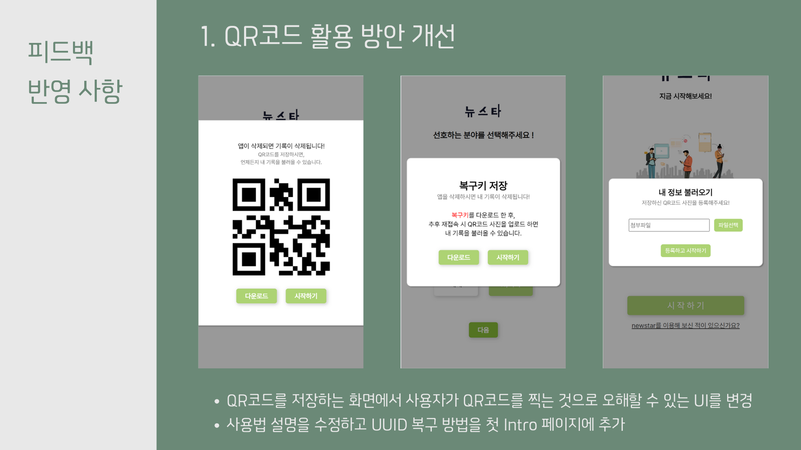
  <br /><br />
  2. 이를 반영하여 2차 배포 때 Intro Page 이후 메인 서비스를 이용하기 전에 TourExample을 만들어 사용자에게 서비스 이용방법을 알려주었습니다.
  <br />
  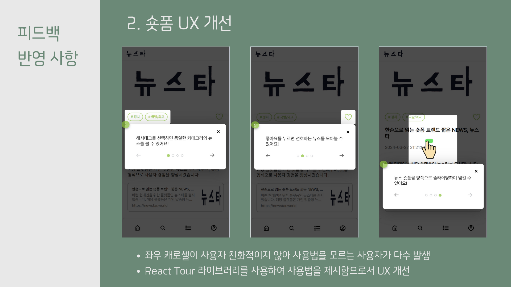
</details>
<br />
<details>
  <summary>2차 피드백 결과</summary>
</details>

<br /><br />

# 협업 환경

### Git으로 협업하기

브랜치로 작업 공간을 나누어 충돌의 방지와 함께 원본 코드를 안전하게 보관하고 체계적이며 독립적으로 개발을 진행할 수 있도록합니다.

이를 위해 사용한 요소는 다음과 같습니다.

- 브랜치 : `master`, `develop`, `feat` 기능 단위로 `feautre` 브랜치를 생성 후 `develop` merge하여 오류 확인 후 master에 최종 merge 하였습니다.

  - develop : BE 와 FE의 develop 브렌치는 따로 관리하지 않고 같이 관리한다.
  - feat : develop에서 브렌치를 따서 개발한다 브렌치명 은 “fe/feat/login” , “be/feat/login” 과 같이 하되 같은 도메인을 개발하게 될때 “fe/feat/login-junyoung”으로 만든다

  ```
  - 예시1) fe/feat/login
  - 예시2) be/feat/login
  - 예시3) fe/feat/login-junyoung  // 같은 도메인을 개발하게 될때
  ```

  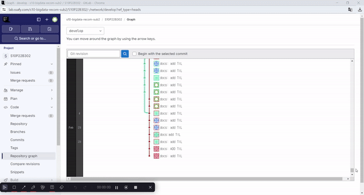

- commit : 기본 적인 커밋 메시지 구조는 `타입`, `위치`, `본문` 세가지 파트로 나눈다. <br />
  [TYPE][TARGET]: [BODY] (콜론과 BODY사이에는 공백 한 칸)
  ```
  - 예시1) feat(login): 로그인 시 아이디 입력 필드가 빈 칸일 경우 예외 처리
  - 예시2) fix(comment): 댓글 작성 시 새로고침을 해야만 해당 댓글이 보이는 버그 수정
  - 예시3) test(Search): 질문 검색 시 비동기 통신을 통해 받아온 키워드 목록의 로그 메시지 출력
  - 예시4) docs: README.md TIL 업데이트 (제약사항에 대한 유동적 해제 - TARGET 생략)
  ```

### Jira로 협업하기

매주 오전 9시 30분 스프린트 회의를 통해 그 전날의 이슈를 공유하고 당일 목표를 세우고 목표 달성을 위한 구체적인 작업을 정리합니다.

공통적인 일정 관리와 파트별 회의, 개인일정까지 모두 함께 공유하며 구체적으로 이슈를 관리합니다.

<!--  -->

### Notion으로 협업하기

회의록, 스크럼 회의, 발표 정리, 문서 정리, 기획서 등 자료들을 Notion을 통해 작성 및 관리하였습니다.

- 주소 : https://www.notion.so/B302-73ea8f5102cf464b838fdac3997bfed7

### 🎨 FIGMA

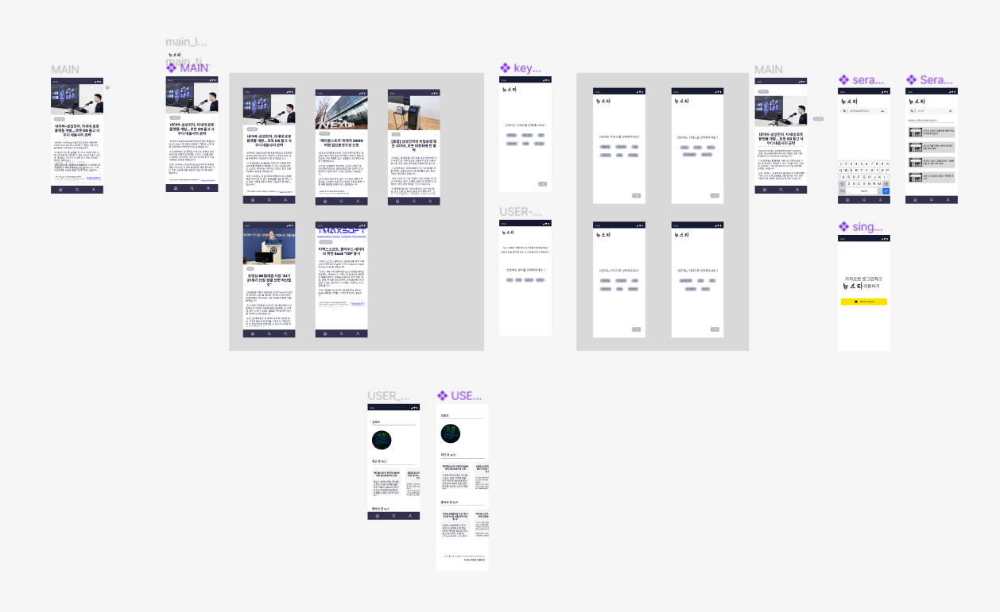

<br /><br />

# 팀원 소개

**B302 👨‍👨‍👧‍👧 : 박찬홍(팀짱), 최준영, 한셩현, 김수환(백짱), 박은미, 김유정**

**FRONTEND**

- `김유정` : UI/UX | 컨텐츠제작자 | PPT
- `박은미` : UI/UX | README

**BACKEND**

- `김수환(백짱)` : 데이터최적화 | 검색 | 설문알리미
- `최준영` : DB 관리 | 발표 | 분위기메이커 | 크롤링
- `한성현` : 알고리즘 | 분석담당

**INFRA**

- `박찬홍(팀짱)` : 팀짱 | 인프라 | 풀스택 | 나라지키미

#### 🔥 GROUND RULE 🔥

1. 프로젝트 시작 전 / 마무리 시 10분씩 스크럼하기
2. 공지 확인시 이모지 표시하기
3. 어?! 금지
4. 지각하면 커피쏘기
5. 모르는거 있으면 물어보기
6. 개인일정 사전에 공유하기
